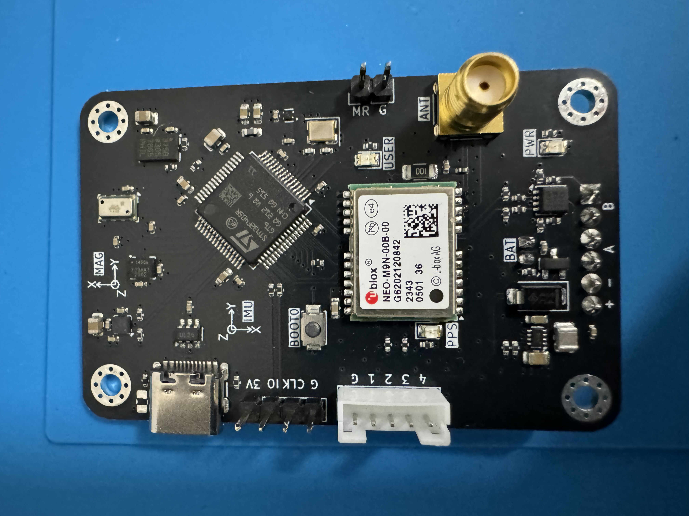
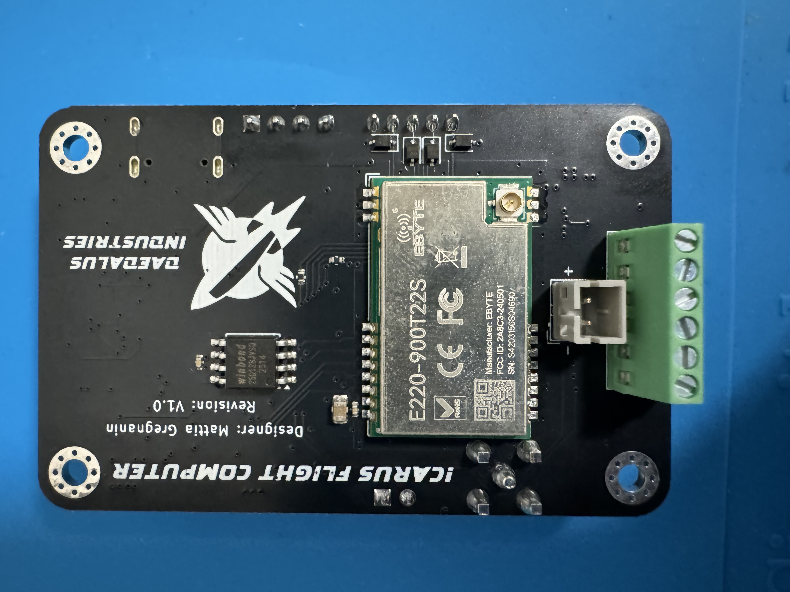

# Icarus Flight Computer V1.0

This repository contains the hardware design files for the version 1.0 of the flight computer developed for Project Icarus, a model rocket.

## 📸 Photos

## 🧰 Overview 

The Icarus Flight Computer V1.0 is designed to manage data acquisition, telemetry, and flight event control during rocket missions. The board includes:
- **Microcontroller**: STMicroelectronics STM32F405RGT6
- **6-Axis IMU**: TDK InvenSense ICM-45686
- **High-G Accelerometer**: Analog Devices ADXL375
- **Magnetometer**: STMicroelectronics LIS2MDL
- **Barometer**: MEAS MS5607
- **GPS Module**: u-blox NEO-M9N
- **Radio Module**: EBYTE E220-900T22S
- **Flash Memory**: Windbond W25Q128JV
- **E-matches**: 2x electric matches for recovery system deployment
- **Power Management**: TPS631000 buck-boost converter
- **Power Supply**: 1S LiPo battery or USB-C power input
